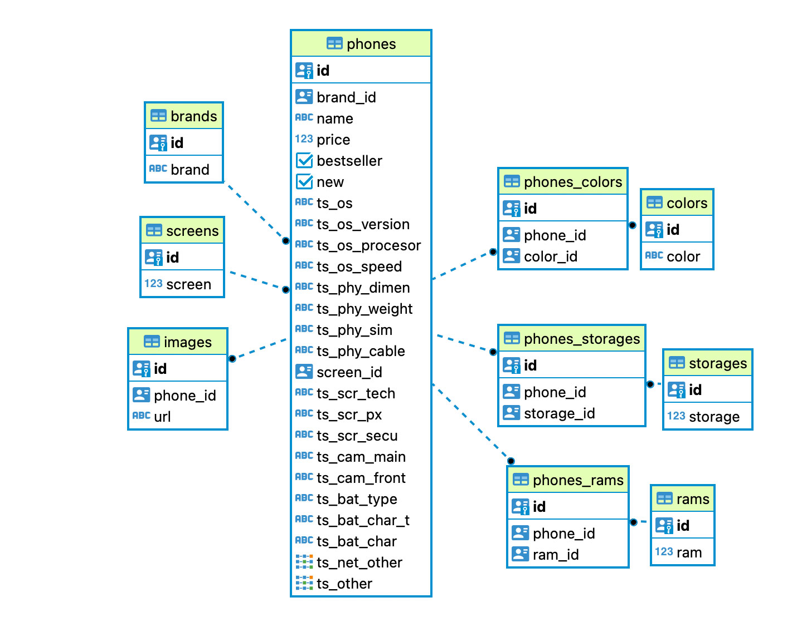

# Phonebey API: Ecommerce Catalog and Product's detail mock API

> ## ✅ FEATURES

> 1. Scope [ Backend structure ]

- The architecture is designed to fulfill the needs of this UX/UI [Prototype](https://www.figma.com/proto/6H5DNUE4O129pjUkssCW55/ob_phonebey?node-id=12%3A17).

> 2. Seed / Web scraping

- store the output JSON at the `/tmp` directory.
- sanitizes the `web scrap` input values
- use the flag `npm run seed -- debug` to visualize the web scrap on the action with a smaller sample and store the output on `script/json`.
- create one-to-one, one-to-many, and many-to-many tables
- handle `ARRAY []` queries to the DB
- store the retrieved products and product variations on the database
- check there are no repeating values stored

> 3. Get all phones

- safely constructs custom queries based on the endpoint's query values.
- supports:

  - no filters, and without order.
  - no filters, and ordered (either ASC or DESC).
  - one filter (single or arrays), and without order.
  - one filter (single or arrays), and ordered (either ASC or DESC).
  - multiple filters (single or arrays), and without order.
  - multiple filters (single or arrays), and ordered (either ASC or DESC).

> 4. Get all filters

- return all values used for filters based on created products.

> 5. Get one phone

- return all the information about a selected phone.

> 6. Add a new phone

- validate user input.
- sanitize uploaded file types `(jpg, png, jpeg)`.
- handle asset storing on the cloud service `cloudinary`.
- return product id.

> 7. Delete one phone

- delete a phone base in its id.
- delete the related assets stored on `cloudinary`.

<br/>

> ## 👋 STACK

Application

- API: `node`, `express`
- web scrap: `puppeteer`

Image management services

- cloud image storage: `multer`, `cloudinary`.

Persistence layer

- DB: `PostgreSQL` via `Slonik` ( on top of `pg`)

Testing

- API e2e: `jest` and `supertest`

Shipping

- `docker`: database

<br/>

> ## 👋 SETUP

<br/>

> 1. Environment setup requirements

Make sure you have installed:

- API:
  - `node` >= 14.17.0
- containers:
  - `docker` >= 1.29.2

<br/>

> 2. Start the repo

```
git clone git@github.com:TommyTraddles/ob_phonebey_api.git
cd …
npm install
npm run docker:up
```

Within the main folder, create a `.env`, and update its info based on the `.env-sample` variables:

Populate the tables and start the server with:

```
npm run seed
npm run start
```

<br/>

> 3. Understanding the scaffold

```bash
  |- /public (assets)
  |- /script (seed)
  |- /src
  |   |- /api
  |       |- endpoints, services, and queries.
  |   |- /config
  |       |- database, cloudinary and multer setups.
  |   |- /middlewares
  |       |- error handler and input validator.
  |   |- /test
  |       |- API tests.
  |   |- index.js
  |- .env
  |- package.json
  |- docker-compose.yml
```

<br/>

> 4. Database schema and relations



<br/>

> ## 👋 SCRIPTS

<br/>

### `npm run seed`

- to web scrap a provider website, and create and populate the databases.
- stores the retrieved data within the `tmp` folder.

<hr/>

### `npm run seed -- debug`

- to visualize the chromium browser.
- retrieving a samll portion of all the available data.
- store the retrieved data within the `script/json` folder.

<hr/>

### `npm run test`

- Execute all available tests (`/src/test`)

<hr/>

### `npm run start`

- run the API.
- ⛔️ See here the API [documentation and sample output](https://documenter.getpostman.com/view/16463884/VUxLw8x2).


<br/>

